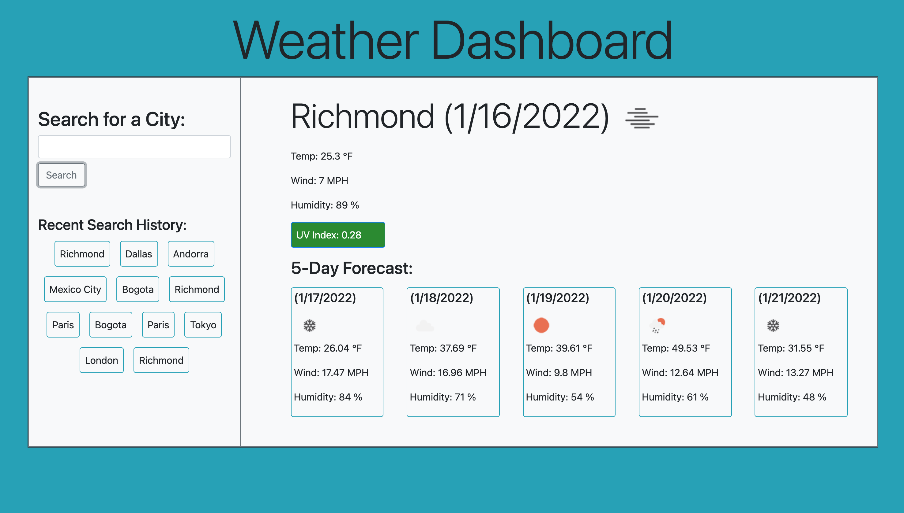

# Weather Dashboard

## Purpose
The purpose of this project is to create an application that allows users to view weather information for a specified. Searching by city name results in the current weather as well as a 5-day forecast for that city. 

## Application Detials

### Features: 
    * Most recent searches are remembered and displayed on page
    * Searching a city results in current weather conditions and a five day forecast 
    * UV index appears color coded by value
    * Responsive layout adjusts by screen size to keep information legible 

### Technologies Used:
    * Open Weather One Call API
    * Open Weather Geocoding API
    * Bootstrap CSS
    * Local Storage API
    * Dynamically generated HTML

## Screenshot

## Deployed Application 

This application is deployed through GitHub Pages. 
This application can be accessed via this link: https://kalecodes.github.io/weather-dashboard/
